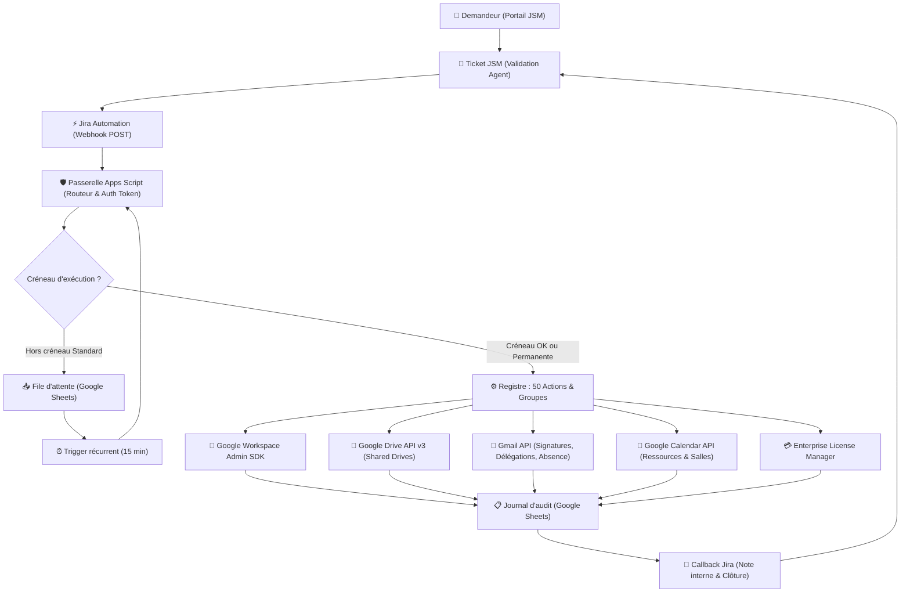
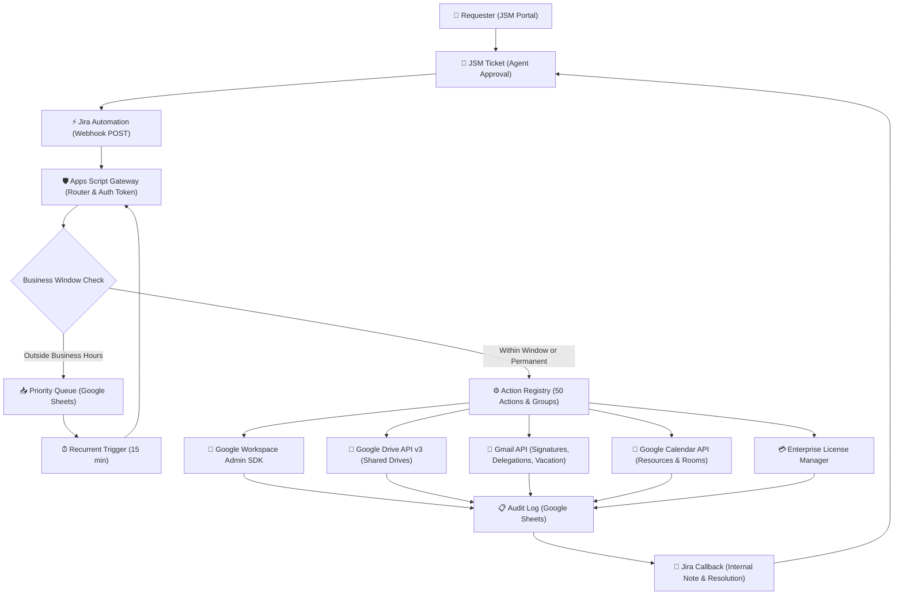

# Passerelle Jira Service Management → Google Workspace

[](CHANGELOG.md)
[](#actions-disponibles-50-actions)
[](https://developers.google.com/admin-sdk)
[](https://www.atlassian.com/software/jira/service-management)
[](LICENSE)

> **v3.3.0** — Automatise 100% des opérations d'administration Google Workspace déclenchées par les formulaires Jira Service Management, avec file d'attente ouvrable, exécution programmée à date future et boucle de retour fermée sur les tickets.

*[English version below](#jira-service-management--google-workspace-gateway)*

---

## Sommaire

1. [Présentation & Architecture](#présentation)
2. [Catalogue des 50 Actions](#actions-disponibles-50-actions)
3. [Groupes d'Actions (Séquences Orchestrées)](#groupes-daction)
4. [Console WebApp & Les 4 Onglets](#console-webapp-interactive--les-4-onglets)
5. [Prérequis & Activation des API Google Cloud](#prérequis--activation-des-api-google-cloud)
6. [Installation & Déploiement](#installation)
7. [Paramètres du Script (Propriétés)](#propriétés-du-script)
8. [Configuration Jira Automation](#configuration-côté-jira)
9. [Actions Gmail & Compte de Service](#actions-gmail-configuration-avancée)
10. [Tests & Recette](#tests--recette)
11. [Sécurité](#sécurité)
12. [Auteur & Licence](#auteur)

---

## Présentation

Lorsqu'un agent ou gestionnaire valide une demande sur le portail Jira Service Management (arrivée d'un collaborateur, départ, mobilité, réinitialisation de mot de passe, création de Drive partagé, réservation de salle, signature officielle...), **Jira Automation** transmet un webhook `POST` sécurisé à la passerelle Google Apps Script.

Le routeur authentifie la requête à temps constant, valide les paramètres, applique les fenêtres d'administration ou la programmation future, exécute l'action via l'Admin SDK Google Workspace, consigne la trace dans le journal d'audit et vient commenter/résoudre automatiquement le ticket Jira.

### Schéma d'Architecture Globale



---

### Actions disponibles (50 actions)

| Action | Description | Fenêtre |
|---|---|---|
| **Comptes** | | |
| `CREATION_COMPTE` | Crée un compte Workspace (profil complet), envoie le mot de passe par canal séparé | Standard |
| `CHANGEMENT_OU` | Déplace un compte dans une autre unité organisationnelle | Standard |
| `MISE_A_JOUR_PROFIL` | Met à jour nom, poste, service, société, centre de coûts, téléphones, manager, adresse, localisation, récupération, visibilité annuaire et **attributs personnalisés** | Standard |
| `RENOMMER_COMPTE` | Change l'adresse principale (l'ancienne devient alias) | Standard |
| `SUPPRESSION_COMPTE` | Supprime définitivement un compte (confirmation obligatoire) | Standard |
| **Groupes** | | |
| `AJOUT_GROUPE` | Ajoute un utilisateur à un groupe (MEMBER, MANAGER, OWNER) | Standard |
| `RETRAIT_GROUPE` | Retire un utilisateur d'un groupe | Permanente |
| `RETRAIT_TOUS_GROUPES` | Retire un utilisateur de tous ses groupes directs (ignore gracieusement les groupes dynamiques) | Permanente |
| `CREATION_GROUPE` | Crée un nouveau groupe Google | Standard |
| `SUPPRESSION_GROUPE` | Supprime un groupe (confirmation obligatoire) | Standard |
| `LISTE_MEMBRES_GROUPE` | Liste les membres d'un groupe (lecture seule) | Permanente |
| `CONFIG_GROUPE` | Modifie les autorisations de publication, modération et accès externe via Groups Settings API | Standard |
| **Alias** | | |
| `AJOUT_ALIAS` | Ajoute un alias e-mail à un compte | Standard |
| `RETRAIT_ALIAS` | Supprime un alias e-mail d'un compte | Standard |
| **Sécurité** | | |
| `SUSPENSION` | Suspend un compte et révoque les sessions actives | Permanente |
| `REACTIVATION` | Réactive un compte précédemment suspendu | Standard |
| `RESET_MOT_DE_PASSE` | Réinitialise le mot de passe avec changement au 1er login | Standard |
| `DECONNEXION_FORCEE` | Déconnecte toutes les sessions (le compte reste actif) | Permanente |
| `REVOCATION_TOKENS_APPS` | Révoque les accès des applications tierces | Permanente |
| `GENERATION_CODES_SECOURS` | Génère de nouveaux codes 2FA (anciens révoqués) | Standard |
| `RETRAIT_INFOS_RECUPERATION` | Supprime l'e-mail et le téléphone de récupération de la fiche d'un compte | Standard |
| **Appareils mobiles (MDM)** | | |
| `EFFACEMENT_APPAREIL` | Efface à distance un appareil (vol, perte) | Permanente |
| `BLOCAGE_APPAREIL` | Bloque un appareil suspect | Permanente |
| `APPROBATION_APPAREIL` | Approuve un nouvel appareil en attente | Standard |
| **Messagerie & Identité** ⚙️ | | |
| `SIGNATURE_EMAIL` | Déploie automatiquement la signature HTML officielle Gmail (charte d'entreprise) ou personnalisée | Standard |
| `DELEGATION_EMAIL` | Donne accès à la boîte mail d'un utilisateur à un délégué | Standard |
| `RETRAIT_DELEGATION_EMAIL` | Retire l'accès d'un délégué à une boîte mail | Standard |
| `REPONSE_ABSENCE` | Active la réponse d'absence automatique | Standard |
| `DESACTIVATION_REPONSE_ABSENCE` | Désactive la réponse d'absence automatique | Standard |
| `TRANSFERT_EMAILS` | Redirige les e-mails entrants vers une autre adresse | Standard |
| `ARRET_TRANSFERT_EMAILS` | Désactive la redirection automatique des e-mails | Standard |
| **Diagnostic & Support** | | |
| `INFO_COMPTE` | Retourne la fiche diagnostic express d'un compte (statut, 2FA, OU, groupes, dernier login, synchro mobile) | Permanente |
| `AUDIT_ACCES_COMPLET` | Revue consolidée complète de tout le patrimoine d'accès (groupes, Drives partagés, agendas, délégations, licences, mobiles, OAuth) | Permanente |
| **Drive & Drives partagés** | | |
| `TRANSFERT_DRIVE` | Transfère la propriété des fichiers Drive à un autre utilisateur | Standard |
| `CREATION_DRIVE_PARTAGE` | Crée un nouveau Shared Drive et lui assigne son gestionnaire initial | Standard |
| `AJOUT_MEMBRE_DRIVE_PARTAGE` | Ajoute un membre ou un groupe à un Drive partagé avec rôle (organizer, fileOrganizer, commenter, reader) | Standard |
| `RETRAIT_MEMBRE_DRIVE_PARTAGE` | Révoque l'accès d'un membre à un Drive partagé | Permanente |
| `RETRAIT_TOUS_DRIVES_PARTAGES` | Révocation en masse de tous les accès directs d'un collaborateur aux Drives partagés (conserve les accès par groupes) | Permanente |
| **Calendriers & Salles** | | |
| `PARTAGE_CALENDRIER` | Accorde l'accès à un agenda Google Calendar (lecture, modification, gestion) | Standard |
| `RETRAIT_PARTAGE_CALENDRIER` | Révoque l'accès d'un collaborateur à un agenda | Permanente |
| `CREATION_RESSOURCE_CALENDRIER` | Crée une nouvelle salle de réunion ou ressource d'entreprise réservable | Standard |
| `SUPPRESSION_RESSOURCE_CALENDRIER` | Supprime définitivement une ressource de calendrier ou salle | Standard |
| **Licences & Archivage** | | |
| `ATTRIBUTION_LICENCE` | Attribue une licence Workspace à un utilisateur | Standard |
| `RETRAIT_LICENCE` | Libère la licence d'un utilisateur (facturée tant qu'assignée) | Standard |
| `ARCHIVAGE_COMPTE` | Archive un compte : déplacement dans `/Archives`, libération licence standard et attribution licence Archived User | Standard |
| **Groupes d'action** (séquences orchestrées) | | |
| `ARRIVEE_COLLABORATEUR` | Onboarding : création du compte + licence + groupes + alias, dans l'ordre | Standard |
| `DEPART_COLLABORATEUR` | Offboarding : transferts + délégation + transfert Drive + retrait groupes + retrait Drives partagés + suspension + retrait licence | Permanente |
| `RETOUR_ABSENCE` | Coupe réponse d'absence, transfert et délégation posés au départ | Standard |
| `URGENCE_COMPROMISSION` | Kill-switch sécurité : suspension + déconnexion + révocation OAuth + blocage appareils | Permanente |
| `MUTATION_INTERNE` | Mobilité interne : déplacement OU + profil RH + retrait anciens groupes + ajout nouveaux groupes | Standard |

> ⚙️ Les actions **Messagerie** nécessitent un compte de service avec délégation de domaine (voir section « Actions Gmail »).
>
> 👥 **Groupes dynamiques** : un groupe dont l'appartenance est calculée automatiquement par une règle d'annuaire n'accepte aucun ajout ni retrait manuel. La passerelle intercepte ce cas sans échec bloquant.
>
> 📅 **Programmation future (`date_execution`)** : vous pouvez passer une date ISO 8601 (ex. `"2026-09-30T18:00:00Z"`) dans le payload pour déclencher l'action à une date/heure exacte.

---

## Console WebApp Interactive & Les 4 Onglets

En ouvrant l'URL de votre application web (`https://script.google.com/macros/s/.../exec`) dans votre navigateur, vous disposez d'un centre de contrôle complet en **Material Design 3** :

1. 🧪 **Onglet 1 — Console d'administration** :
   * **Mode Unitaire** : Formulaire interactif pour tester en temps réel les **50 actions** avec bouton « Remplir avec un exemple ».
   * **Mode Séquence Multi-Actions** : Permet de lancer à la suite plusieurs actions pour un même compte cible (`email_cible`) avec préréglages 1-clic (*Offboarding express*, *Kill-Switch Sécurité*, *Nettoyage des accès*, *Diagnostic complet*, *Arrêt messagerie*), suivi pas-à-pas en direct et export du rapport d'exécution.
   * Sécurité étanche : accès réservé aux e-mails déclarés dans `ADMIN_UI_EMAILS`.
2. 📋 **Onglet 2 — Banc d'Essai & Recette** :
   * Matrice de qualification opérationnelle couvrant les 50 actions.
   * Sélecteur de statut (🟢 *Validé*, 🟡 *À tester*, 🔴 *Anomalie*, ⚪ *Non applicable*) et saisie d'observations persistées dans le script.
   * Bouton « Exporter le bilan » pour générer le PV de recette officiel en Markdown.
3. 📖 **Onglet 3 — Guide d'Intégration JSM** :
   * Documentation interactive pour configurer vos règles Jira Automation.
   * Exemples de payloads JSON pré-remplis avec les Smart Values Atlassian.
4. 📊 **Onglet 4 — Présentation & Schéma Directeur** :
   * Visualisation comparative entre l'ancien traitement manuel dispersé et le flux unique automatisé.
   * Schémas SVG interactifs et synthèse des 4 gains majeurs.

---

## Prérequis & Activation des API Google Cloud

Pour que l'ensemble des 50 actions fonctionnent, les API Google Cloud suivantes doivent être actives dans votre projet GCP :

| API Google | Utilisation dans la passerelle | Activation dans GCP |
|---|---|---|
| **Admin SDK API** | Gestion des comptes, unités organisationnelles, groupes et appareils | **Services > Admin SDK API > Ajouter** dans Apps Script |
| **Google Drive API (v3)** | Drives partagés (`RETRAIT_TOUS_DRIVES_PARTAGES`, création, membres) | [Activer l'API Google Drive](https://console.developers.google.com/apis/api/drive.googleapis.com/overview) |
| **Enterprise License Manager API** | Attribution et libération des licences Workspace | [Activer l'API License Manager](https://console.developers.google.com/apis/api/licensing.googleapis.com/overview) |
| **Groups Settings API** | Configuration et modération des groupes (`CONFIG_GROUPE`) | Incluse dans les scopes du projet |
| **Google Calendar API** | Salles de réunion et partages d'agendas | Incluse dans les scopes du projet |

---

## Installation

1. **Créer le projet Apps Script** : Cloner ou copier les fichiers `.gs` et `.html` dans votre projet.
2. **Configurer le fuseau horaire** : Dans Paramètres du projet → Fuseau horaire : `Europe/Paris`.
3. **Générer le secret d'authentification** : Exécuter la fonction `setup_genererToken()`.
4. **Installer le déclencheur** : Exécuter `setup_installerDeclencheur()` pour créer le trigger de file d'attente (toutes les 15 min).
5. **Déployer l'application web** :
   * **Déployer > Nouveau déploiement > Application Web**.
   * Exécuter en tant que : *Moi-même*.
   * Qui a accès : *Tout le monde* (requis pour les webhooks Jira, sécurisé par `SECRET_TOKEN` et `ADMIN_UI_EMAILS`).

---

## Propriétés du script

À renseigner dans **Paramètres du projet > Propriétés du script** :

| Propriété | Obligatoire | Description |
|---|---|---|
| `SECRET_TOKEN` | ✅ | Jeton secret partagé pour authentifier les requêtes Jira |
| `AUDIT_SHEET_ID` | ✅ | Identifiant du classeur Google Sheets d'audit et file d'attente |
| `ALLOWED_DOMAINS` | ✅ | Domaines Workspace autorisés (ex: `cooperl.com, filiale.fr`) |
| `ADMIN_UI_EMAILS` | ✅ (console) | Adresses e-mail autorisées à utiliser la console Web (séparées par virgules) |
| `NOTIFY_EMAIL` | Recommandé | E-mail recevant les alertes et mots de passe temporaires |
| `JIRA_BASE_URL` | Optionnel | URL Jira Cloud (ex: `https://mon-domaine.atlassian.net`) pour callbacks |
| `JIRA_USER_EMAIL` | Optionnel | E-mail du compte de service Jira pour les commentaires |
| `JIRA_API_TOKEN` | Optionnel | Jeton d'API REST Jira Cloud |
| `JIRA_AUTO_RESOLVE` | Optionnel | `true` pour passer automatiquement les tickets Jira à « Résolu » |
| `LICENSE_SKU_ID` | Optionnel | SKU de licence Workspace par défaut (ex. `1010020020`) |
| `LICENSE_SKU_ARCHIVE` | Optionnel | SKU de licence d'archivage Google Vault (ex. `1010020030`) |
| `DEFAULT_OU` | Optionnel | Unité organisationnelle par défaut (ex: `/Collaborateurs`) |
| `SERVICE_ACCOUNT_EMAIL` | Optionnel | E-mail du compte de service DWD (requis pour actions Gmail) |
| `SERVICE_ACCOUNT_KEY` | Optionnel | Clé privée PEM du compte de service |

---

## Configuration côté Jira

Dans votre règle **Jira Automation** (sur validation du ticket) :
* **Action** : *Send web request*
* **Méthode** : `POST`
* **URL** : `URL_DE_VOTRE_DEPLOIEMENT_WEBAPP`
* **Headers** : `Content-Type: application/json`
* **Custom data (JSON)** :

```json
{
  "secret_token": "votre-secret-token",
  "action": "CREATION_COMPTE",
  "ticket_key": "{{issue.key}}",
  "request_id": "{{issue.key}}-{{now.epochMillis}}",
  "data": {
    "prenom": "{{issue.Prénom}}",
    "nom": "{{issue.Nom}}",
    "email_souhaite": "{{issue.Email souhaité}}",
    "issue_key": "{{issue.key}}"
  }
}
```

---

# Jira Service Management → Google Workspace Gateway

[](CHANGELOG.md)
[](#available-actions-50-actions)
[](https://developers.google.com/admin-sdk)
[](https://www.atlassian.com/software/jira/service-management)
[](LICENSE)

> **v3.3.0** — Fully automates 100% of Google Workspace administration operations triggered by Jira Service Management tickets, featuring business-hours scheduling, future date/time dispatch, and closed-loop Jira issue updates.

---

## Table of Contents

1. [Overview & Architecture](#overview)
2. [Catalogue of 50 Actions](#available-actions-50-actions)
3. [Action Groups (Orchestrated Sequences)](#action-groups)
4. [Interactive WebApp & The 4 Tabs](#interactive-webapp-control-center--the-4-tabs)
5. [Prerequisites & Google Cloud API Enablement](#prerequisites--google-cloud-api-enablement)
6. [Setup & Deployment](#setup)
7. [Script Configuration (Properties)](#script-properties)
8. [Jira Automation Setup](#jira-webhook-configuration)
9. [Gmail & Domain-Wide Delegation Setup](#gmail-service-account-setup)
10. [Testing & Verification](#testing--verification)
11. [Security](#security)
12. [Author & License](#author)

---

## Overview

When a JSM agent or manager approves a ticket (employee onboarding, offboarding, internal transfer, password reset, Shared Drive creation, calendar room provisioning, company-wide HTML signature...), **Jira Automation** sends a secure `POST` webhook to this Google Apps Script WebApp.

The router verifies authentication in constant time, validates input parameters, applies admin business windows or future execution scheduling, performs the operation via the Google Workspace Admin SDK, logs execution to the audit spreadsheet, and comments/auto-resolves the Jira ticket.

### System Architecture



---

### Available Actions (50 actions)

| Action | Description | Window |
|---|---|---|
| **Accounts** | | |
| `CREATION_COMPTE` | Creates a Workspace account (full profile) and sends credentials via separate channel | Standard |
| `CHANGEMENT_OU` | Moves an account to another organisational unit | Standard |
| `MISE_A_JOUR_PROFIL` | Updates name, job title, department, company, cost centre, phones, manager, address, recovery, directory visibility & **custom attributes** | Standard |
| `RENOMMER_COMPTE` | Renames primary email address (old address preserved as alias) | Standard |
| `SUPPRESSION_COMPTE` | Permanently deletes an account (mandatory confirmation) | Standard |
| **Groups** | | |
| `AJOUT_GROUPE` | Adds a user to a group (MEMBER, MANAGER, OWNER) | Standard |
| `RETRAIT_GROUPE` | Removes a user from a group | Permanent |
| `RETRAIT_TOUS_GROUPES` | Removes a user from all direct groups (gracefully skips dynamic groups) | Permanent |
| `CREATION_GROUPE` | Creates a new Google Group | Standard |
| `SUPPRESSION_GROUPE` | Deletes a group (mandatory confirmation) | Standard |
| `LISTE_MEMBRES_GROUPE` | Lists group members (read-only) | Permanent |
| `CONFIG_GROUPE` | Updates posting permissions, moderation and external access via Groups Settings API | Standard |
| **Aliases** | | |
| `AJOUT_ALIAS` | Adds an email alias to an account | Standard |
| `RETRAIT_ALIAS` | Removes an email alias from an account | Standard |
| **Security** | | |
| `SUSPENSION` | Suspends an account and revokes active sessions | Permanent |
| `REACTIVATION` | Reactivates a suspended account | Standard |
| `RESET_MOT_DE_PASSE` | Resets password with mandatory change on next login | Standard |
| `DECONNEXION_FORCEE` | Signs out all active user sessions (account remains active) | Permanent |
| `REVOCATION_TOKENS_APPS` | Revokes third-party application OAuth tokens | Permanent |
| `GENERATION_CODES_SECOURS` | Generates new 2FA backup verification codes | Standard |
| `RETRAIT_INFOS_RECUPERATION` | Clears recovery email and phone from an account profile | Standard |
| **Mobile Devices (MDM)** | | |
| `EFFACEMENT_APPAREIL` | Remotely wipes a mobile device (lost/stolen) | Permanent |
| `BLOCAGE_APPAREIL` | Blocks a suspicious mobile device | Permanent |
| `APPROBATION_APPAREIL` | Approves a pending mobile device | Standard |
| **Email & Identity** ⚙️ | | |
| `SIGNATURE_EMAIL` | Automatically deploys official company HTML email signature or custom layout | Standard |
| `DELEGATION_EMAIL` | Grants mailbox delegation access to another user | Standard |
| `RETRAIT_DELEGATION_EMAIL` | Revokes mailbox delegation access | Standard |
| `REPONSE_ABSENCE` | Enables automatic out-of-office vacation responder | Standard |
| `DESACTIVATION_REPONSE_ABSENCE` | Disables out-of-office responder | Standard |
| `TRANSFERT_EMAILS` | Forwards incoming emails to another address | Standard |
| `ARRET_TRANSFERT_EMAILS` | Disables automatic email forwarding | Standard |
| **Diagnostics & Support** | | |
| `INFO_COMPTE` | Quick identity sheet (status, 2FA, OU, groups, last login, mobile sync) | Permanent |
| `AUDIT_ACCES_COMPLET` | Consolidated full security audit of all permissions (groups, Shared Drives, calendars, delegations, licenses, OAuth) | Permanent |
| **Drive & Shared Drives** | | |
| `TRANSFERT_DRIVE` | Transfers Google Drive file ownership to another user | Standard |
| `CREATION_DRIVE_PARTAGE` | Creates a new Shared Drive and assigns initial organizer | Standard |
| `AJOUT_MEMBRE_DRIVE_PARTAGE` | Adds member or group to Shared Drive with role (organizer, fileOrganizer, commenter, reader) | Standard |
| `RETRAIT_MEMBRE_DRIVE_PARTAGE` | Revokes user or group access from Shared Drive | Permanent |
| `RETRAIT_TOUS_DRIVES_PARTAGES` | Bulk revocation of all direct user permissions across all Shared Drives (preserves group-inherited access) | Permanent |
| **Calendars & Meeting Rooms** | | |
| `PARTAGE_CALENDRIER` | Grants Google Calendar sharing access (read, write, manage) | Standard |
| `RETRAIT_PARTAGE_CALENDRIER` | Revokes calendar sharing access | Permanent |
| `CREATION_RESSOURCE_CALENDRIER` | Creates a new bookable meeting room or building resource | Standard |
| `SUPPRESSION_RESSOURCE_CALENDRIER` | Permanently deletes a calendar resource | Standard |
| **Licenses & Archiving** | | |
| `ATTRIBUTION_LICENCE` | Assigns a Workspace license SKU to a user | Standard |
| `RETRAIT_LICENCE` | Releases a user license (billed while assigned) | Standard |
| `ARCHIVAGE_COMPTE` | Moves account to `/Archives`, frees standard license, and assigns Archived User SKU | Standard |
| **Action Groups** (orchestrated sequences) | | |
| `ARRIVEE_COLLABORATEUR` | Onboarding: account creation + license + groups + aliases in sequence | Standard |
| `DEPART_COLLABORATEUR` | Offboarding: email forward + delegation + Drive transfer + group removal + Shared Drive revocation + suspension + license release | Permanent |
| `RETOUR_ABSENCE` | Return from leave: disables vacation responder, forward and delegation | Standard |
| `URGENCE_COMPROMISSION` | Security kill-switch: suspension + sign-out + token revocation + device block | Permanent |
| `MUTATION_INTERNE` | Internal transfer: OU move + HR profile update + group rotation | Standard |

---

## Interactive WebApp Control Center & The 4 Tabs

Opening the deployed WebApp URL in your browser gives you an enterprise **Material Design 3** control center:

1. 🧪 **Tab 1 — Admin Console**:
   * **Single Action Mode**: Interactive execution console for all **50 actions** with one-click "Fill with example" button.
   * **Multi-Action Sequence Runner**: Run multiple actions in sequence on a single target account (`email_cible`) with 1-click presets (*Offboarding express*, *Security Kill-Switch*, *Access cleanup*, *Diagnostics & Audit*, *Mailbox deactivation*), live stepper progress, and execution report export.
   * Access restricted strictly to emails declared in `ADMIN_UI_EMAILS`.
2. 📋 **Tab 2 — Test Bench & Acceptance**:
   * Operational qualification matrix covering all 50 actions.
   * Status toggles (🟢 *Validated*, 🟡 *Pending*, 🔴 *Defect*, ⚪ *N/A*) and notes persisted across sessions.
   * One-click "Export Report" to generate an official Markdown acceptance document.
3. 📖 **Tab 3 — JSM Integration Guide**:
   * Interactive documentation with copy-pasteable JSON payloads for Jira Automation.
4. 📊 **Tab 4 — Presentation & Master Architecture**:
   * Interactive SVG diagrams showing the transformation from manual fragmented tasks to the unified gateway.

---

## Prerequisites & Google Cloud API Enablement

Ensure the following APIs are enabled in your Google Cloud Project:

| Google Cloud API | Purpose in Gateway | How to Enable |
|---|---|---|
| **Admin SDK API** | User, OU, group, building, and mobile device management | **Services > Admin SDK API > Add** in Apps Script |
| **Google Drive API (v3)** | Shared Drive management and bulk permission cleanup | [Enable Google Drive API](https://console.developers.google.com/apis/api/drive.googleapis.com/overview) |
| **Enterprise License Manager API** | Automatic Workspace license assignment & reclamation | [Enable License Manager API](https://console.developers.google.com/apis/api/licensing.googleapis.com/overview) |
| **Groups Settings API** | Group moderation and external access settings | Included in project OAuth scopes |
| **Google Calendar API** | Resource rooms and calendar ACL management | Included in project OAuth scopes |

---

## Setup

1. **Create Apps Script Project**: Clone or copy `.gs` and `.html` files into your project.
2. **Set Timezone**: In Project Settings → Time zone: `Europe/Paris`.
3. **Generate Authentication Secret**: Run `setup_genererToken()` in the editor.
4. **Install Trigger**: Run `setup_installerDeclencheur()` to enable queue processing (every 15 min).
5. **Deploy Web App**:
   * **Deploy > New deployment > Web app**.
   * Execute as: *Me*.
   * Who has access: *Anyone* (required for Jira webhooks, secured by `SECRET_TOKEN` and `ADMIN_UI_EMAILS`).

---

## Script Properties

Configure in **Project Settings > Script Properties**:

| Property | Required | Description |
|---|---|---|
| `SECRET_TOKEN` | ✅ | Shared secret token for webhook bearer authentication |
| `AUDIT_SHEET_ID` | ✅ | Google Sheets spreadsheet ID for audit trail and queue |
| `ALLOWED_DOMAINS` | ✅ | Allowed Google Workspace domains (e.g. `cooperl.com, subsidiary.com`) |
| `ADMIN_UI_EMAILS` | ✅ (console) | Comma-separated admin email addresses authorized to use the web console |
| `NOTIFY_EMAIL` | Recommended | Email address for alerts and temporary credentials |
| `JIRA_BASE_URL` | Optional | Jira Cloud base URL (e.g. `https://my-domain.atlassian.net`) for callbacks |
| `JIRA_USER_EMAIL` | Optional | Jira service account email for commenting |
| `JIRA_API_TOKEN` | Optional | Jira Cloud REST API token |
| `JIRA_AUTO_RESOLVE` | Optional | `true` to auto-resolve Jira issues on successful execution |
| `LICENSE_SKU_ID` | Optional | Default Workspace license SKU (e.g. `1010020020`) |
| `LICENSE_SKU_ARCHIVE` | Optional | Google Vault Archive SKU (e.g. `1010020030`) for `ARCHIVAGE_COMPTE` |
| `DEFAULT_OU` | Optional | Default Organisational Unit (e.g. `/Employees`) |
| `SERVICE_ACCOUNT_EMAIL` | Optional | GCP Service Account email with DWD (required for Gmail actions) |
| `SERVICE_ACCOUNT_KEY` | Optional | Private key PEM string of the Service Account |

---

## Jira Webhook Configuration

In your **Jira Automation** rule:
* **Action**: *Send web request*
* **Method**: `POST`
* **URL**: `YOUR_WEBAPP_DEPLOYMENT_URL`
* **Headers**: `Content-Type: application/json`
* **Custom data (JSON)**:

```json
{
  "secret_token": "your-secret-token",
  "action": "CREATION_COMPTE",
  "ticket_key": "{{issue.key}}",
  "request_id": "{{issue.key}}-{{now.epochMillis}}",
  "data": {
    "prenom": "{{issue.Prénom}}",
    "nom": "{{issue.Nom}}",
    "email_souhaite": "{{issue.Email souhaité}}",
    "issue_key": "{{issue.key}}"
  }
}
```

---

## Security

* **Shared Secret & Constant-Time Verification**: Constant-time authentication check (`safeEquals_`) preventing timing attacks.
* **Strict Identity Control (`assertAdminUI_`)**: All console features require caller email validation against `ADMIN_UI_EMAILS`.
* **Least Privilege Principle**: Passwords never returned in HTTP payloads, all output systematically HTML-escaped.
* **Immutable Audit Trail**: Unique `trace_id` logged across Google Sheets and Google Cloud Logging.
* **Fail-Safe**: Internal error stack traces are never exposed to Jira; user-facing sanitized error messages only.

---

## License

MIT — See `LICENSE` file for details.

---

## Author

**Fabrice Faucheux** — [https://faucheux.bzh](https://faucheux.bzh)
